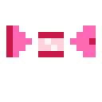
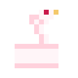
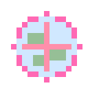
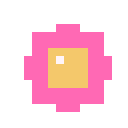
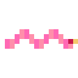

<div align="center">


</div>

<br>


##  About Me

Hi! I'm **Barbie** — an aspiring software developer who wants to build technology that's as beautiful as it is meaningful. My interests span **front-end development, AI, human-computer interaction, and UX/UI design**.

I'm currently sharpening my skills in **Python, JavaScript, Linux, Git**, and modern web tools — while exploring how psychology and design come together to shape better digital experiences.

Long-term, I want to work at the intersection of **software engineering, robotics, AI, and human-centered design** — building things that genuinely make people's everyday lives a little softer and a little smarter.

Outside of code, you'll find me lost in music, neuroscience rabbit holes, dreamy interfaces, and turning stray creative ideas into real, finished projects. 

<br>

<table align="center">
<tr>
<td></td><td>Based in <b>Johannesburg, South Africa</b></td>
</tr>
<tr>
<td></td><td>Currently learning <b>robotics</b></td>
</tr>
<tr>
<td></td><td>Looking to <b>collaborate</b> on interesting, pretty projects</td>
</tr>
<tr>
<td></td><td>Ask me about <b>music</b> — send me that playlist!</td>
</tr>
</table>


<div align="center">

##  My Tech Stack 

</div>

<p align="center">
<a href="https://developer.mozilla.org/en-US/docs/Web/JavaScript" target="_blank" rel="noreferrer"></a><a href="https://www.python.org/" target="_blank" rel="noreferrer"></a><a href="https://docs.microsoft.com/en-us/cpp/?view=msvc-170" target="_blank" rel="noreferrer"></a><a href="https://docs.microsoft.com/en-us/cpp/?view=msvc-170" target="_blank" rel="noreferrer"></a><a href="https://docs.microsoft.com/en-us/dotnet/csharp/" target="_blank" rel="noreferrer"></a><a href="https://www.oracle.com/java/" target="_blank" rel="noreferrer"></a><a href="https://www.typescriptlang.org/" target="_blank" rel="noreferrer"></a><a href="https://code.visualstudio.com/" target="_blank" rel="noreferrer"></a><a href="https://developer.mozilla.org/en-US/docs/Glossary/HTML5" target="_blank" rel="noreferrer"></a><a href="https://www.w3.org/TR/CSS/#css" target="_blank" rel="noreferrer"></a><a href="https://svelte.dev/" target="_blank" rel="noreferrer"></a><a href="https://nuxtjs.org/" target="_blank" rel="noreferrer"></a><a href="https://reactjs.org/" target="_blank" rel="noreferrer"></a><a href="https://www.mysql.com/" target="_blank" rel="noreferrer"></a><a href="https://nodejs.org/en/" target="_blank" rel="noreferrer"></a><a href="https://firebase.google.com/" target="_blank" rel="noreferrer"></a><a href="https://www.oracle.com/uk/index.html" target="_blank" rel="noreferrer"></a><a href="https://docs.nestjs.com/" target="_blank" rel="noreferrer"></a><a href="https://fastapi.tiangolo.com/" target="_blank" rel="noreferrer"></a><a href="https://www.figma.com/" target="_blank" rel="noreferrer"></a><a href="https://www.adobe.com/uk/products/photoshop.html" target="_blank" rel="noreferrer"></a><a href="https://www.adobe.com/uk/products/illustrator.html" target="_blank" rel="noreferrer"></a><a href="https://cloud.google.com/" target="_blank" rel="noreferrer"></a><a href="https://portal.azure.com/" target="_blank" rel="noreferrer"></a><a href="https://webflow.com/" target="_blank" rel="noreferrer"></a><a href="https://wix.com" target="_blank" rel="noreferrer"></a><a href="https://squarespace.com" target="_blank" rel="noreferrer"></a><a href="https://wordpress.com" target="_blank" rel="noreferrer"></a><a href="https://www.raspberrypi.org/" target="_blank" rel="noreferrer"></a><a href="https://www.yoctoproject.org/" target="_blank" rel="noreferrer"></a><a href="https://store.arduino.cc/" target="_blank" rel="noreferrer"></a><a href="https://www.linux.org" target="_blank" rel="noreferrer"></a><a href="https://fedoraproject.org/" target="_blank" rel="noreferrer"></a><a href="https://www.djangoproject.com/" target="_blank" rel="noreferrer"></a><a href="https://dotnet.microsoft.com/en-us/" target="_blank" rel="noreferrer"></a><a href="https://flutter.dev/" target="_blank" rel="noreferrer"></a><a href="https://aws.amazon.com" target="_blank" rel="noreferrer"></a><a href="https://www.blender.org/" target="_blank" rel="noreferrer"></a><a href="https://pytorch.org/" target="_blank" rel="noreferrer"></a><a href="https://huggingface.co/" target="_blank" rel="noreferrer"></a><a href="https://www.docker.com/" target="_blank" rel="noreferrer"></a>
</p>


<div align="center">

##  GitHub Stats 


</div>


<details>
<summary> Want the animated "snake" contribution graph too? (click to expand)</summary>
<br>

GitHub won't auto-generate this one — it needs a tiny one-time setup in your own repo, since it renders your *own* contribution history as a moving snake:

1. In this repo, go to **Settings → Actions → General** and make sure Actions are enabled.
2. Create a new file at `.github/workflows/snake.yml` with this content:

```yaml
name: Generate Snake
on:
  schedule:
    - cron: "0 */6 * * *"
  workflow_dispatch:
  push:
    branches: [ main ]

jobs:
  generate:
    runs-on: ubuntu-latest
    permissions:
      contents: write
    steps:
      - uses: Platane/snk@v3
        with:
          github_user_name: ${{ github.repository_owner }}
          outputs: |
            dist/pink-snake.svg?palette=github-light&color_snake=#FF69B4&color_dots=FFE4EC,FFD1DC,FFB6C1,FF8FAB,FF69B4
      - uses: crazy-max/ghaction-github-pages@v4
        with:
          target_branch: output
          build_dir: dist
        env:
          GITHUB_TOKEN: ${{ secrets.GITHUB_TOKEN }}
```

3. Push it, let the Action run once, then add this line back into your README wherever you'd like the snake to appear:

```md

```

That's it — it'll quietly re-render itself every few hours, pink dots and all. 

</details>

<br>

<div align="center">

##  Let's Connect 

<a href="https://www.github.com/missbarbiemthecoder-prettyVamp" target="_blank" rel="noreferrer">

</a>
<a href="https://missbarbiemthecoder-prettyVamp.hashnode.dev" target="_blank" rel="noreferrer">

</a>

<br><br>


</div>


<!--
**missbarbiemthecoder-prettyVamp/missbarbiemthecoder-prettyVamp** is a  _special_  repository because its `README.md` (this file) appears on your GitHub profile.
-->
